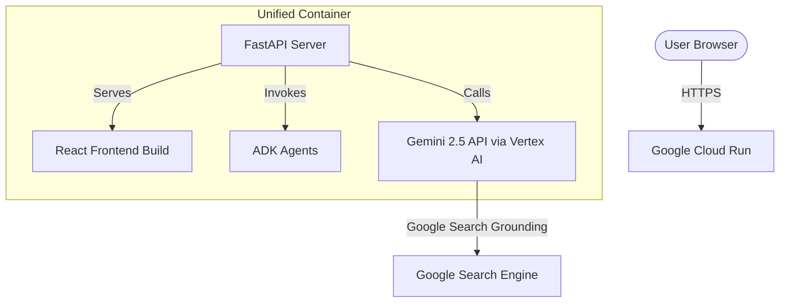

# Deploying LocusGemini to Google Cloud Run

This guide outlines how to stand up the unified **LocusGemini** application (React frontend + FastAPI backend + ADK Agents) on **Google Cloud Run**.

---

## Architecture Overview



By serving the pre-compiled React frontend static assets directly from our FastAPI daemon, the entire application compiles into a single Docker image and runs on a single Cloud Run instance. This simplifies hosting, eliminates CORS configuration issues in production, and reduces cold-start overhead.

---

## Prerequisites

Ensure you have the following configured on your local development machine:

1. **Google Cloud SDK (`gcloud`)** installed and authenticated:
   ```bash
   gcloud auth login
   gcloud auth application-default login
   ```
2. **Billing Enabled**: The target Google Cloud project must have billing enabled to use Vertex AI and Cloud Run.
3. **Active Project**:
   * Our active hackathon project ID is: `noted-fact-500702-h4`
   * Target deployment region: `us-central1`

---

## Required Google Cloud APIs

Make sure the required APIs are enabled in your project:

```bash
gcloud services enable \
    run.googleapis.com \
    artifactregistry.googleapis.com \
    cloudbuild.googleapis.com \
    aiplatform.googleapis.com \
    logging.googleapis.com
```

---

## Service Account Permissions (IAM)

Cloud Run services run under a runtime Service Account (by default, the **Compute Engine default service account** or a user-created custom service account). 

To allow the ADK and Gemini API client to run predictions and queries:
1. Go to the **IAM & Admin** page in your Google Cloud Console.
2. Ensure the Cloud Run runtime service account has the **Vertex AI User** (`roles/aiplatform.user`) role:
   ```bash
   gcloud projects add-iam-policy-binding noted-fact-500702-h4 \
       --member="serviceAccount:PROJECT_NUMBER-compute@developer.gserviceaccount.com" \
       --role="roles/aiplatform.user"
   ```
   *(Replace `PROJECT_NUMBER` with your actual Google Cloud Project Number).*

---

## Deploying to Cloud Run

We provide two approaches for deployment. 

### Method A: Single-Command Source Deployment (Recommended)

Google Cloud Run can build your container using Google Cloud Build directly from your local directory and deploy it in one step:

```bash
gcloud run deploy locus-gemini \
    --source . \
    --project noted-fact-500702-h4 \
    --region us-central1 \
    --platform managed \
    --allow-unauthenticated \
    --set-env-vars="ENV=production,PORT=8080,GOOGLE_GENAI_USE_VERTEXAI=1,GOOGLE_CLOUD_PROJECT=noted-fact-500702-h4,GOOGLE_CLOUD_LOCATION=us-central1"
```

> [!NOTE]
> Cloud Run automatically injects the `PORT` environment variable (typically `8080`). Our FastAPI entrypoint detects this environment variable to bind to the correct port.

---

### Method B: Manual Container Build & Push

If you prefer building the container explicitly and pushing it to Artifact Registry:

#### 1. Create an Artifact Registry Repository
```bash
gcloud artifacts repositories create locus-gemini-repo \
    --repository-format=docker \
    --location=us-central1 \
    --description="LocusGemini Container Repository"
```

#### 2. Build and Tag the Image
```bash
docker build -t us-central1-docker.pkg.dev/noted-fact-500702-h4/locus-gemini-repo/locus-gemini:latest .
```

#### 3. Push to Artifact Registry
```bash
# Configure docker credential helper
gcloud auth configure-docker us-central1-docker.pkg.dev

# Push the image
docker push us-central1-docker.pkg.dev/noted-fact-500702-h4/locus-gemini-repo/locus-gemini:latest
```

#### 4. Deploy the Staged Image to Cloud Run
```bash
gcloud run deploy locus-gemini \
    --image us-central1-docker.pkg.dev/noted-fact-500702-h4/locus-gemini-repo/locus-gemini:latest \
    --project noted-fact-500702-h4 \
    --region us-central1 \
    --platform managed \
    --allow-unauthenticated \
    --set-env-vars="ENV=production,PORT=8080,GOOGLE_GENAI_USE_VERTEXAI=1,GOOGLE_CLOUD_PROJECT=noted-fact-500702-h4,GOOGLE_CLOUD_LOCATION=us-central1"
```

---

## Verification

Once deployment finishes, `gcloud` will print a secure Service URL (e.g., `https://locus-gemini-xxxxxx-uc.a.run.app`). 

Open this URL in your web browser to view your glassmorphic frontend, upload location images/flyers, and test real-time LocusGuide chat grounding.
