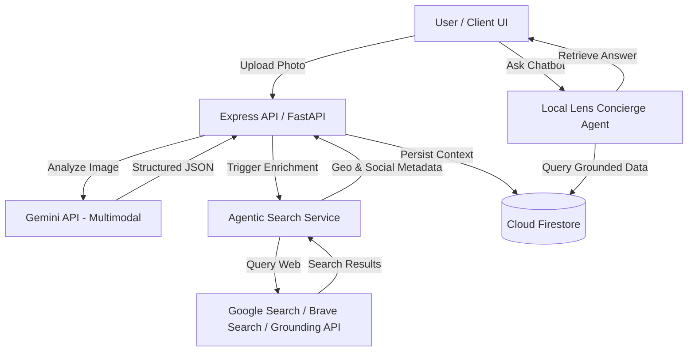

# PRODUCT PLAN: Local Lens (EventLens AI)

## 1. Executive Summary
**Local Lens** is a hyperlocalized event and context builder application designed for the Gemini AI Tokyo Hackathon. It bridges physical real-world discoveries (from flyer photos, restaurant menus, and billboards) with an enriched, digital, interactive hyperlocal map and agentic concierge.

By uploading a single photo, users instantly generate rich structured models of events, venues, or restaurants, enriched autonomously with real-time web search integration, mapping, and a context-aware chat assistant.

---

## 2. Target User Experience & Key Flows

### Flow A: Snap & Build (Visual Ingestion)
1. **Capture**: A user walking through Tokyo spots an interesting concert flyer, a pop-up store poster, or a restaurant menu. They snap a photo and upload it.
2. **Multimodal Extraction**: Gemini's vision capability parses the image and instantly structure-maps it (JSON schema) into an Event, Restaurant, or Venue object.
3. **Agentic Enrichment**: The app fires an autonomous search agent that:
   - Finds geo-coordinates (lat/lng) for accurate mapping.
   - Fetches official links (tickets, reservations), ratings, and social handles.
   - Resolves ambiguities (e.g., if a date is listed as "Next Friday", the agent resolves it based on the upload metadata).
4. **Map Placement**: The entity is added to the shared map dashboard with a beautiful visual card showing image thumbnails, schedules, and active vibes.

### Flow B: Interactive Hyperlocal Dashboard
1. **Interactive Map**: A highly responsive visual map interface featuring custom styled markers, popups, and radius rings.
2. **Pulse Feed**: A timeline of upcoming events and trending spots filtered by location and "vibe" tags (e.g., *Cyberpunk*, *Cozy*, *Acoustic*, *Underground*).
3. **Vibe Filters**: Categorize discoveries by categories (Events, Venues, Food & Drink) and temporal filters (Today, This Weekend, Next Week).

### Flow C: Local Lens Concierge (AI Agent Chat)
1. **Context-Grounded Chat**: A side-panel chatbot grounded in all uploaded and parsed events/venues in the active viewport.
2. **Intelligent Querying**: Users ask: *"What acoustic gigs are happening around Shibuya tonight that serve craft beer?"* or *"Plan a 3-hour itinerary around our newly added gallery event."*
3. **Structured Recommendations**: Local Lens Concierge renders clickable map-link chips directly in the chat output.

---

## 3. Core System Architecture

### Components
1. **Frontend**: Next.js or React + Vite, styled using Vanilla CSS with a rich dark glassmorphic design, Mapbox/Leaflet/Google Maps, and custom micro-animations.
2. **Backend**: Node.js/Express or Python/FastAPI, handling file uploads, orchestrating Gemini multimodal parser, and storing to Cloud Firestore.
3. **Database**: Google Cloud Firestore to hold collections of `events`, `venues`, `restaurants`, and geo-spatial indices.
4. **Agent Suite**:
   - **Ingestion Agent**: Grounded image parser.
   - **Enrichment Agent**: Active web-searching worker utilizing Google Search Grounding to verify addresses, dates, and ticket prices.
   - **Concierge Agent (Local Lens Concierge)**: Conversational agent using Gemini's system instructions and Firestore search function tool calling to guide users.

---

## 4. Proposed Parallel Execution Plans

To ensure rapid development and compatibility with both local testing and remote Google Cloud Run deployment, we divide the project into **three modular tracks** that can be built in parallel.

### Track 1: Foundation & General Architecture (Produce in docs/ first)
- **Objective**: Establish shared data schemas, draft documentation, set up repo skeleton.
- **Local/Remote**: Shared. Done in `docs/` and root level.

### Track 2: Local Core Development Session (Active Local Session)
- **Objective**: Build the local-ready web app frontend and the core Gemini ingestion pipeline.
- **Key Deliverables**:
  1. **Frontend App (`/frontend`)**: Responsive, beautiful React/Vite layout, visual dropzone, responsive list/map split screen, interactive mock map.
  2. **Ingestion & Parser Pipeline (`/backend`)**: API endpoint `/api/ingest` that accepts photos, runs Gemini API multimodal parsing, and converts them to precise JSON.
  3. **Local Database Emulation**: Set up Cloud Firestore local simulator or direct Firebase Web SDK connection so that data persists seamlessly during local dev.

### Track 3: Remote Deployment & Agentic Web-Enrichment Track (Cloud Run Session)
- **Objective**: Containerize backend, build the autonomous search-enrichment agent, and prepare deployment scripts for Google Cloud Run.
- **Key Deliverables**:
  1. **Docker Core**: Write a multi-stage `Dockerfile` and `docker-compose.yml` to package frontend and backend.
  2. **Agentic Enrichment Worker**: Implement a background agent using Brave Search or Google Search Grounding API to fetch latitude/longitude geo-coordinates and verify dates/prices.
  3. **Google Cloud Run Deployment Automation**: Setup `deploy.sh` script or Cloud Build configuration to deploy to Cloud Run with SSH key credentials securely.
